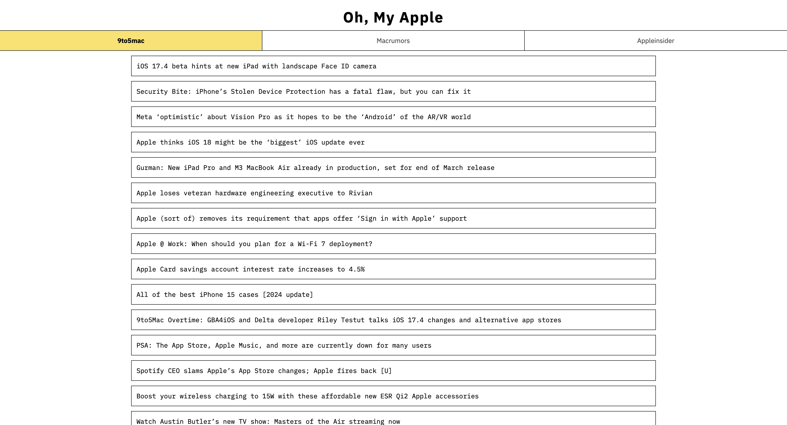

# Oh My Apple

This project seamlessly obtains content from various Apple-related websites, creating a consolidated platform for accessing news. It employs web scraping techniques to extract headlines, subsequently presenting them in a visually appealing and organized format.

## Setup
System requirements: `node lts`, `go 1.21` & `docker`

Start by cloning the repo, run `pnpm i` and `go mod download`, once thats done all you need to do is `pnpm dev` and the project should be visible on `localhost:8080`

This project already has the necessary files to be deployed in GCloud

Made with ❤️
